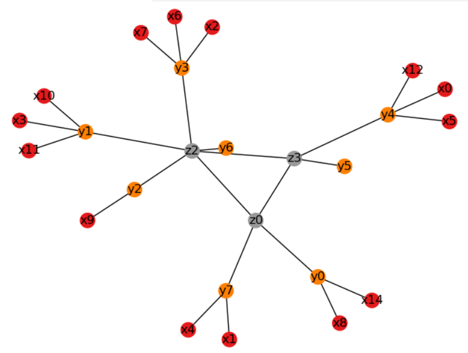
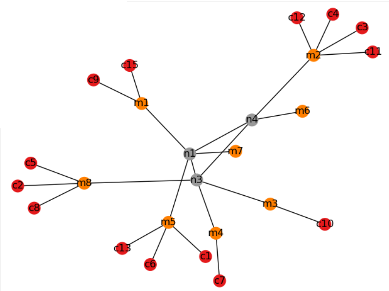
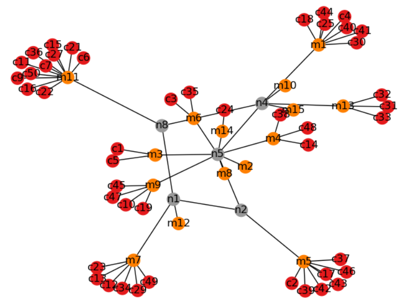
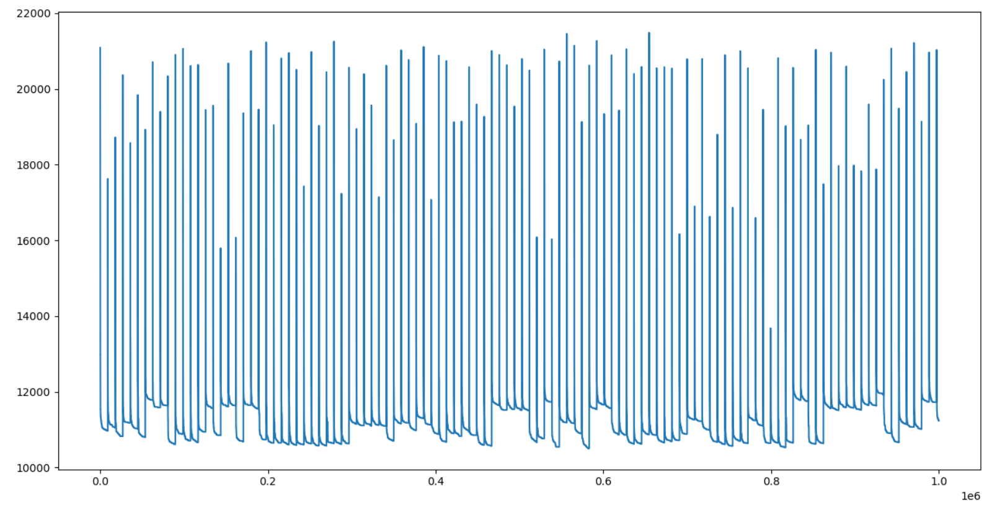

# SER_RO
The aim of this study is to optimize a telecommunication network.
The input elements of the problem include a set of end offces, a set of digital hubs, and a set of customer locations that are geographically distributed on a plane. Each customer location is connected directly to its own designated end office, which in turn needs to be connected to exactly one selected hub. Then the selected hubs must be connected by a ring.
There are costs for every connection made and the aim is to build a network with a minimum cost.

## Optimized solution
Found with Pulp for a small instance with a cost of 5119 :
>

## Almost optimized solution  
Found with a ILS algorithm  
Small instance :
> cost : 5133  
> runtime : 158s for 1M iterations  
>  

Large instance :
> cost : 10504  
> runtime : 342s for 1M iterations  
>

Evolution of the cost at each iteration (large instance) : 
>
